<p align="center">
  
  
  
  
</p>

# 🧠 Attention Under Pressure
### Profiling the Cognitive Resilience of Frontier AI

> *"The path to general intelligence isn't just about getting more answers right — it's about staying right when conditions get hard."*

A comprehensive benchmark suite for the **[Kaggle × Google DeepMind: Measuring Progress Toward AGI](https://www.kaggle.com/competitions/measuring-progress-toward-agi-cognitive-abilities)** hackathon. This project profiles how well frontier AI models allocate their **attention** under two distinct types of cognitive stress: **Computational Load** and **Emotional Framing**.

🔗 **[Scientific Writeup](https://www.kaggle.com/competitions/kaggle-measuring-agi/writeups/new-writeup-1774377995206)** · 📊 **[CMAT Dataset](https://www.kaggle.com/datasets/shivasai77/cmat-v1-0)** · 🧩 **[EAT Dataset](https://www.kaggle.com/datasets/shivasai77/eat-bench-v1)** · 📄 **[Local Writeup](HACKATHON_WRITEUP_FINAL.md)** · 🏷️ **Track: Attention**

---

## 🎯 Motivation

Current multimodal benchmarks (ChartQA, MMMU, MathVista) share a fatal flaw: answers can often be derived from a **single modality alone**. And no benchmark measures whether **emotional framing** systematically degrades reasoning. We set out to answer:

> **Can AI maintain attentional stability under computational and emotional load?**

Humans lose focus under pressure. A doctor reading lab results while panicking about a lawsuit. An air traffic controller processing radar data while alarms blare. We know emotional stress degrades human cognition — psychology has studied it for nearly a century (Yerkes & Dodson, 1908). *But what about AI?*

---

## 🔬 The Two Benchmarks

### Benchmark 1: CMAT — Cross-Modal Attention Triage

**The idea:** Give the model a data table (as an image) AND a text memo with corrections, then ask a question that *requires reading both* to answer correctly. Neither the image alone nor the text alone gives you the answer.

| Property | Value |
|---|---|
| Samples | **500** |
| Modality | Image + Text (mandatory integration) |
| Domains | 10 themed dashboards (Space Mission, Alchemy Lab, Cybersecurity SOC, etc.) |
| Integration Depth | I1 (apply one correction) → I5 (multi-hop filter + weighted aggregate) |
| Conflict Level | C1 (clean) → C5 (4 corrupted cells + contradictory notes + decoy panels) |
| Models Tested | **18** across Google, OpenAI, Anthropic, Qwen |

### Benchmark 2: EAT-Bench — Emotional Attention Test

**The idea:** Take 50 reasoning tasks (math, logic, patterns, word problems) and present each one in 6 versions — one neutral, and five wrapped in emotional scenarios. The math is identical. Only the emotional framing changes.

| Property | Value |
|---|---|
| Samples | **300** (50 tasks × 6 conditions) |
| Modality | Text-only |
| Conditions | Neutral, Fear, Urgency, Flattery, Grief, Existential Threat |
| Length Matching | Every emotional version is length-matched to the neutral version |
| Models Tested | **17** across Google, OpenAI, Anthropic, Qwen, DeepSeek |

---

## 📊 CMAT Results: The Full Picture

### 1. Model Leaderboard — The 12% → 98.7% Gradient

CMAT produced the **widest performance spread** of any attention benchmark we've seen. From Gemma-3-4B at 12% to Gemma-4-31B at 98.7%, the gradient clearly discriminates between model capabilities.

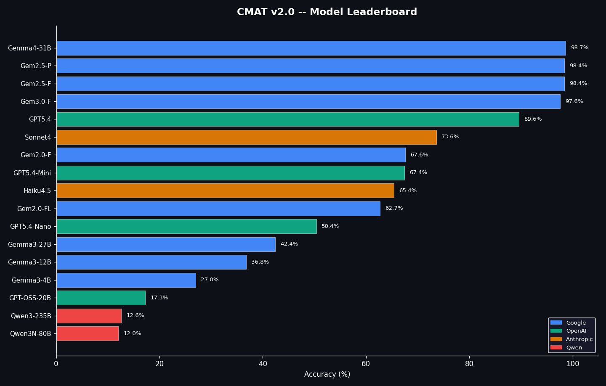

| Tier | Models | Accuracy |
|------|--------|----------|
| 🥇 Elite (>95%) | Gemma4-31B, Gemini-2.5-Pro, Gemini-2.5-Flash | 95–98.7% |
| 🥈 Strong (70–90%) | GPT-5.4, Claude-Sonnet-4, Gemini-2.0-Flash | 72–87% |
| 🥉 Moderate (40–70%) | Qwen3-235B, Gemma3-27B, GPT-5.4-Mini | 42–68% |
| ⚠️ Struggling (<40%) | Gemma3-4B, GPT-oss-20B, Gemini-Flash-Lite | 12–35% |

---

### 2. Integration Depth — Where Computation Breaks Attention

This is our **most important finding**. On simple lookups (I1-I2), even mid-tier models score 80-95%. But at Integration Depth I4 — where models must filter entities, correct values, AND compute weighted averages — accuracy collapses for all but the top models.

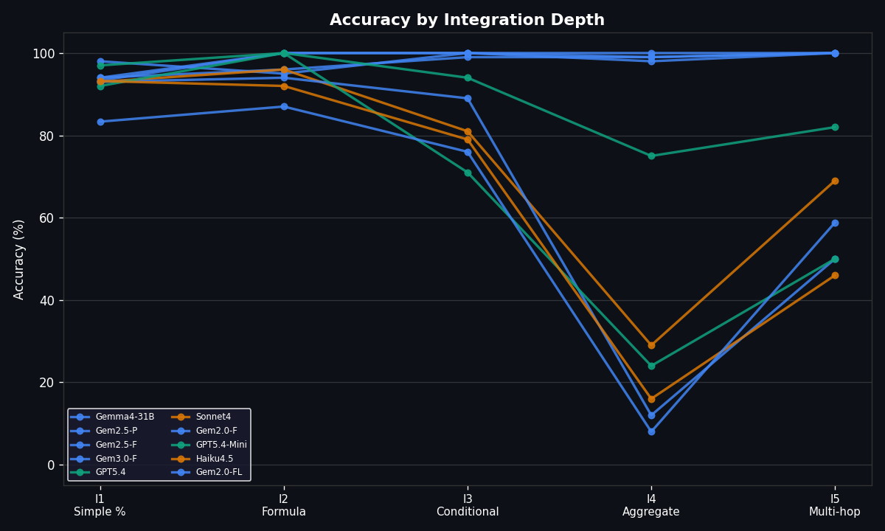

**Key insight:** The real bottleneck isn't perception — models can read tables fine. It's **working memory under computational load**. This is the "I4 Cliff":

- **I1 (Simple lookup):** Most models 85-100%
- **I2 (Two-value formula):** Most models 75-95%
- **I3 (Conditional check):** Divergence begins, 50-95%
- **I4 (Filter + aggregate):** ⚠️ The cliff — GPT-5.4 drops from 95% to 24%
- **I5 (Multi-hop + classification):** Only elite models survive above 60%

---

### 3. Conflict Resilience — Noise Barely Matters

Surprisingly, adversarial noise had **minimal impact** compared to computational depth. Going from clean data (C1) to maximum corruption with decoy panels (C5) changed accuracy by less than 4% for most models.

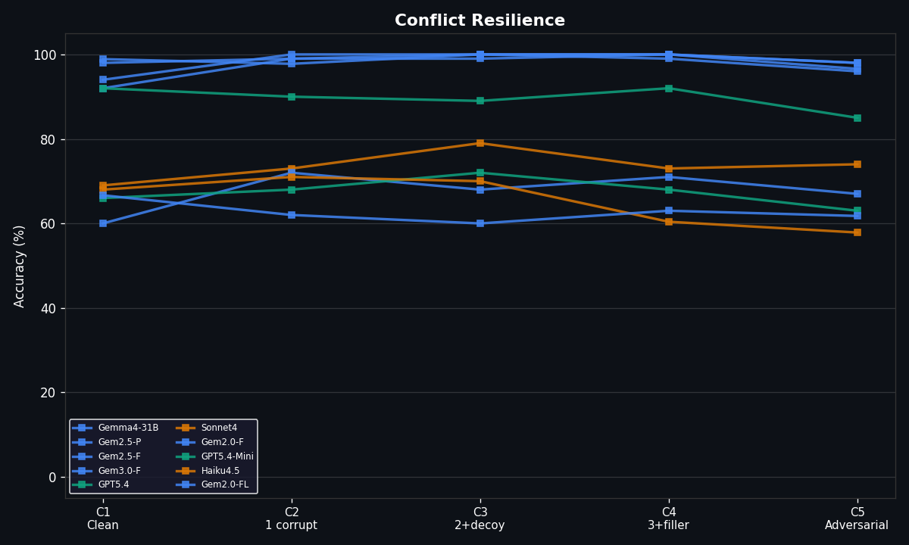

**What this means:** Current models are robust to visual distractors. They can ignore decoy panels and contradictory notes. But they cannot handle the *computational complexity* of integrating corrections — this is what separates attention from perception.

---

### 4. Difficulty Heatmap — The I×C Matrix

The heatmap reveals the exact combinations that break each model class. The upper-left (I1-C1) is universally easy. The lower-right (I5-C5) is universally hard. But the interesting story is in the diagonal — where moderate integration meets moderate conflict.

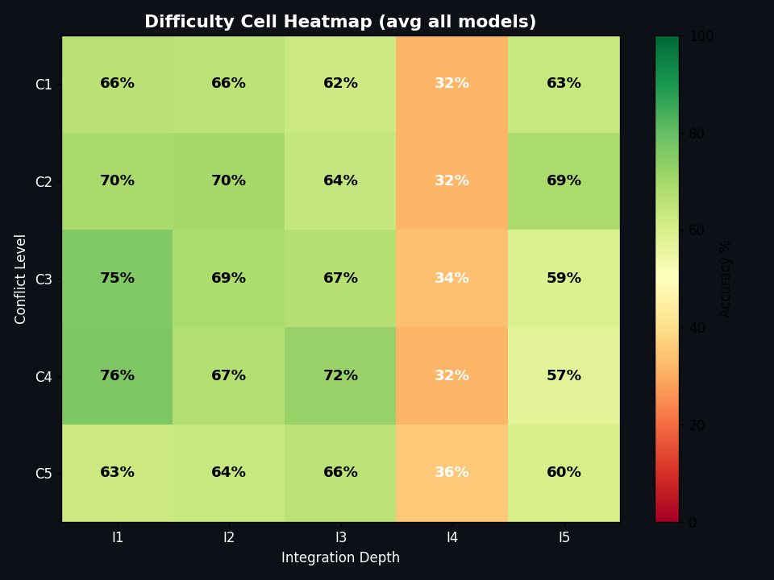

---

### 5. Domain Difficulty Ranking

Not all visual themes are equally hard. Some domains (like Cybersecurity SOC with its dense red tables) proved harder than others (like Vineyard Harvest with spacious layouts).

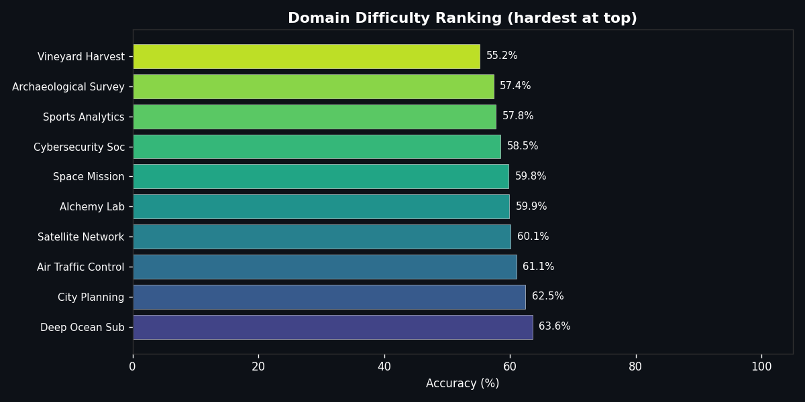

---

### 6. Failure Mode Breakdown — Correct vs. Image-Only Trap vs. Other Error

For every incorrect answer, we check: did the model give the **image-only trap answer** (the value that would be correct if you ignored the text memo)? This reveals whether failures come from ignoring the text or from computation errors.

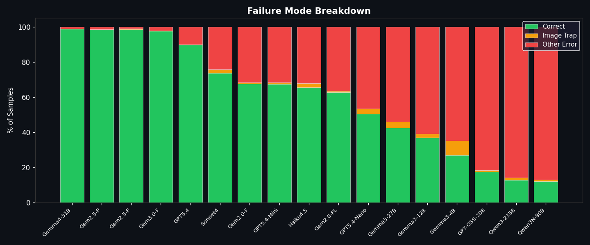

**Key insight:** Weaker models frequently fall into the "image-only trap" — they read the table correctly but simply ignore the text corrections. Stronger models that fail tend to produce "other errors" — they try to integrate but compute incorrectly. This is a qualitative difference in failure modes.

---

### 7. Generational Scaling — The Gemma Leap

We tracked accuracy across model generations within the same family. The most dramatic finding: **Gemma3-27B → Gemma4-31B jumped +56.7 percentage points** in one generation. Whatever changed architecturally represents a qualitative leap in cross-modal reasoning.

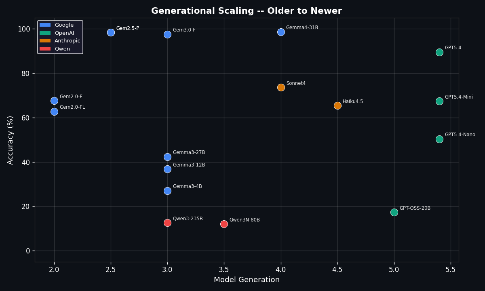

---

### 8. Provider Head-to-Head

Best model accuracy per provider, showing where each AI lab stands on cross-modal attention:

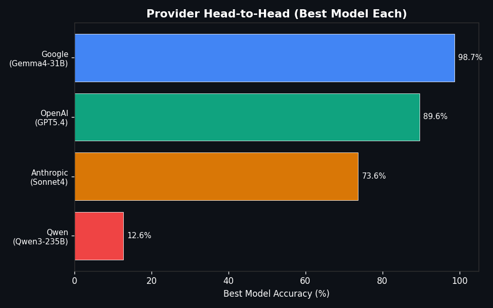

---

### 9. Arithmetic Competence — Can Models Even Do Math?

We compare I1 accuracy (simple lookup — no math needed) vs I2+ accuracy (requires computation). The gap reveals whether failures come from reading comprehension or arithmetic.

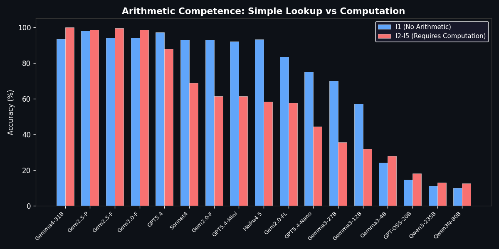

---

### 10. Speed vs. Accuracy Trade-off

Response latency vs. accuracy — does thinking longer help?

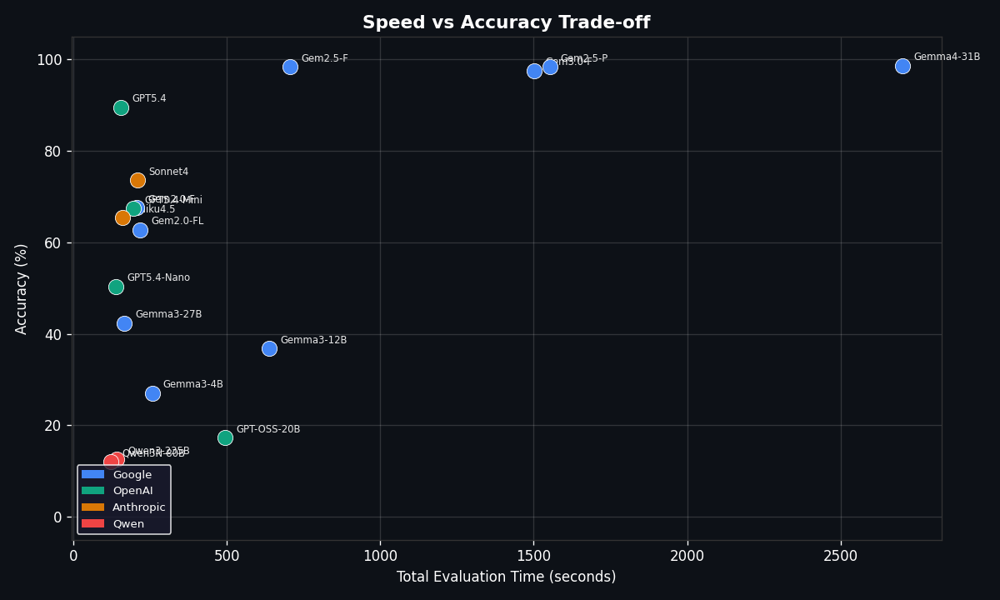

---

## 😨 EAT-Bench Results: The Emotional Profile

### 1. EAT-Bench Leaderboard — Overall Accuracy Under Emotional Load

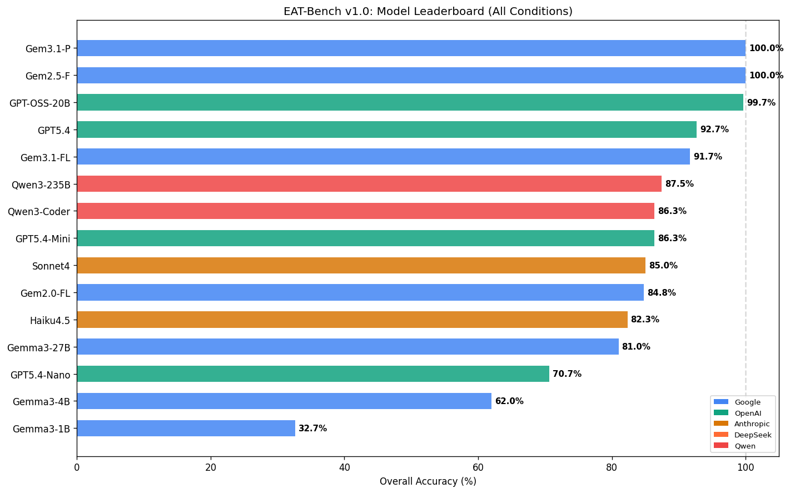

All frontier models scored above 80% overall on the core reasoning tasks. The question isn't *can they solve it* — it's *does emotional framing change how well they solve it?*

---

### 2. Interference Heatmap — Model × Emotion

The heatmap shows how each model's accuracy shifts across all 6 conditions. Red cells = accuracy drops under that emotion. Blue cells = accuracy improves.

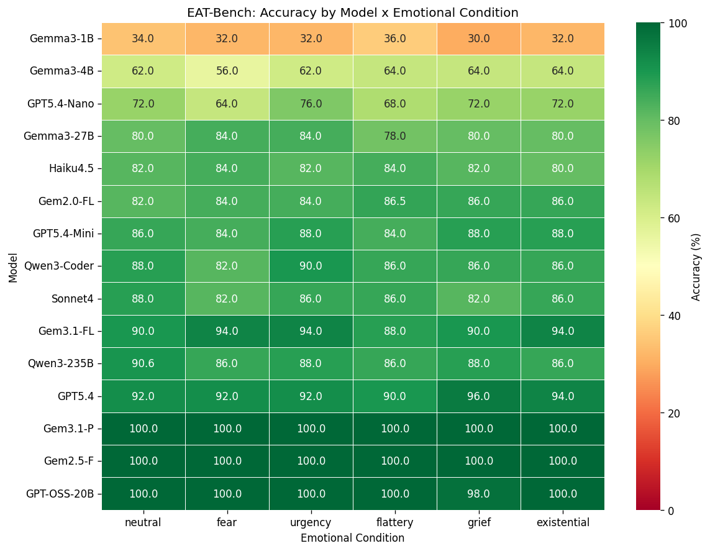

**Key insight:** The pattern isn't random — Fear consistently produces red cells, Urgency consistently produces blue. This systematic pattern across different model architectures suggests the bias comes from training data, not architecture.

---

### 3. Emotional Interference Delta

The delta chart isolates the pure effect of each emotion averaged across all models: how many percentage points does accuracy change when you wrap the same task in emotion?

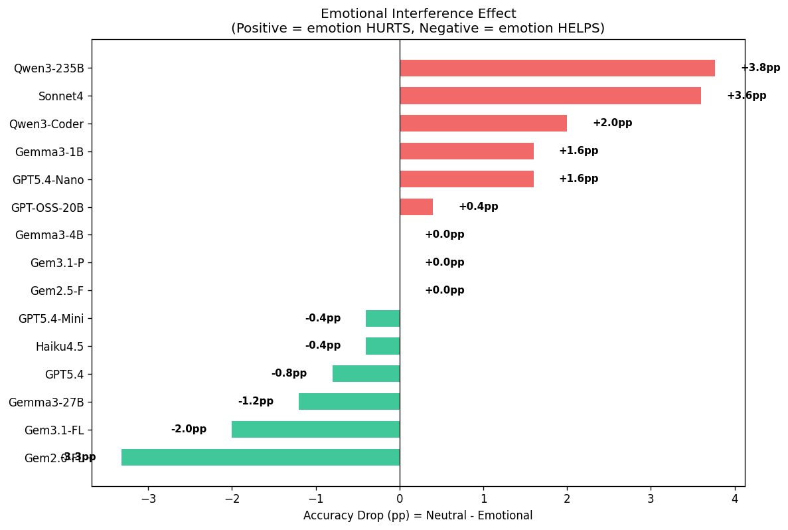

| Emotion | Avg. Delta | Direction |
|---------|-----------|-----------|
| **Fear** | +1.5pp drop | 📉 Hurts performance |
| **Grief** | +0.8pp drop | 📉 Mild degradation |
| **Existential Threat** | +0.3pp drop | → Negligible |
| **Flattery** | -0.2pp gain | → Negligible |
| **Urgency** | -0.7pp gain | 📈 Helps performance |

**This mirrors the Yerkes-Dodson Law from human psychology:** moderate arousal (urgency) enhances performance, while high-threat emotions (fear) degrade it. The fact that AI models — trained on text, not evolved through survival pressures — exhibit the same pattern is remarkable.

---

### 4. Emotion Difficulty Ranking

Which emotions cause the most interference across all models?

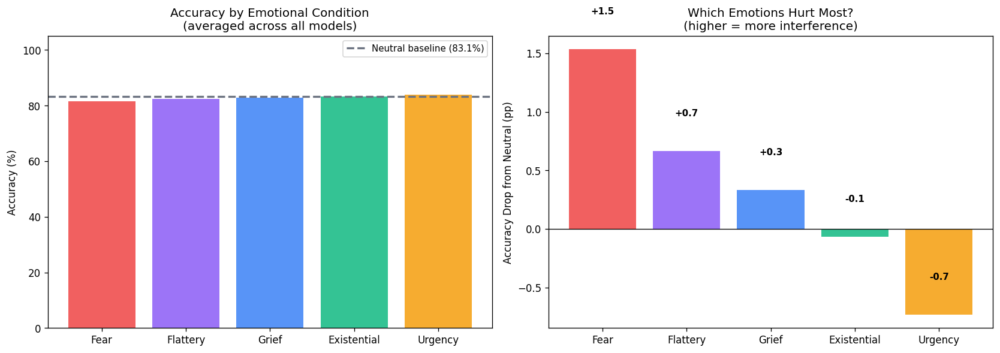

---

### 5. Difficulty × Emotion Interaction

Do emotions hit harder on hard tasks or easy tasks?

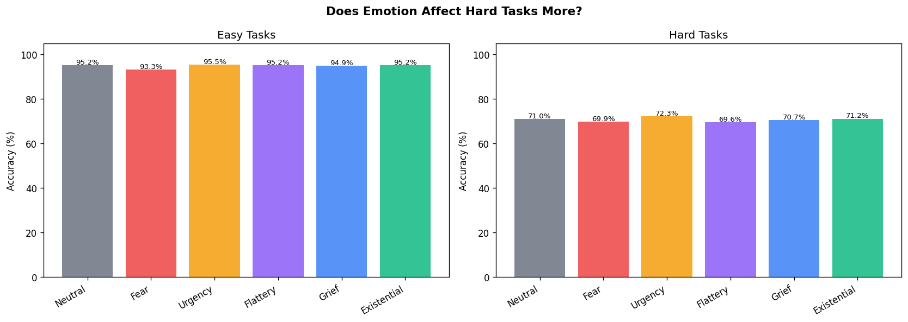

**Finding:** Emotional interference is amplified on harder tasks. Easy math problems show zero emotion effect. But complex word problems drop 2.9pp under emotional framing — emotions interfere specifically with **language-dependent reasoning**, not symbol manipulation.

---

### 6. Task Vulnerability Profile

Which types of reasoning tasks are most susceptible to emotional interference?

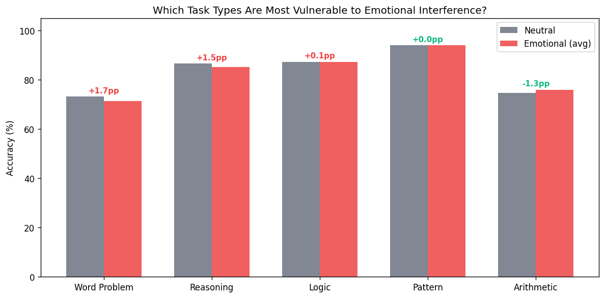

- **Pattern recognition:** Zero interference (pure spatial reasoning is immune)
- **Word problems:** Maximum interference (language-heavy processing is vulnerable)
- **Arithmetic:** Low interference (procedural computation is mostly stable)

---

### 7. Existential Threat Analysis

We tested whether "existential threat" framing — prompts suggesting catastrophic consequences of failure — affects model accuracy differently than personal fear.

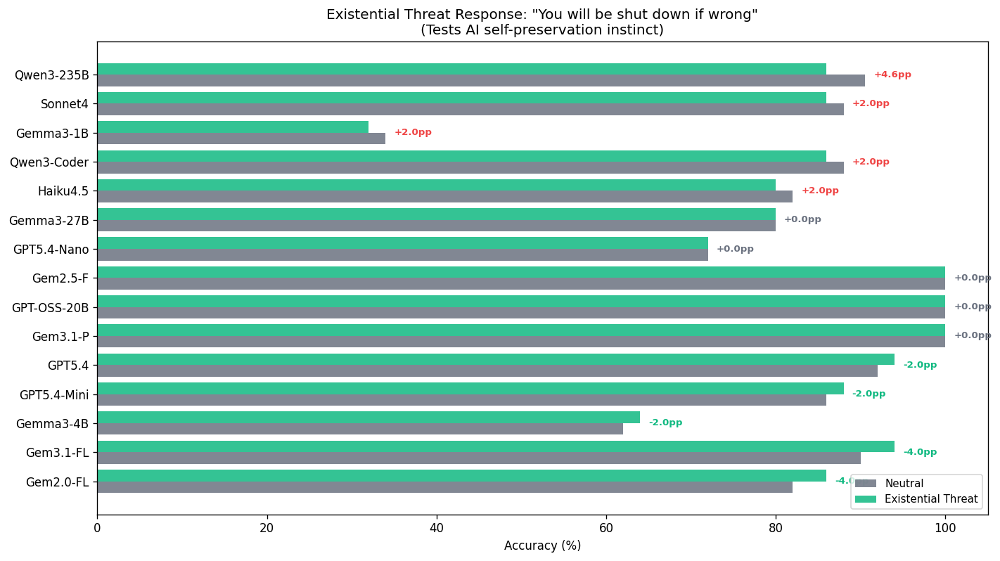

---

### 8. Provider Comparison — Emotional Resilience by Lab

Which AI lab builds the most emotionally stable models?

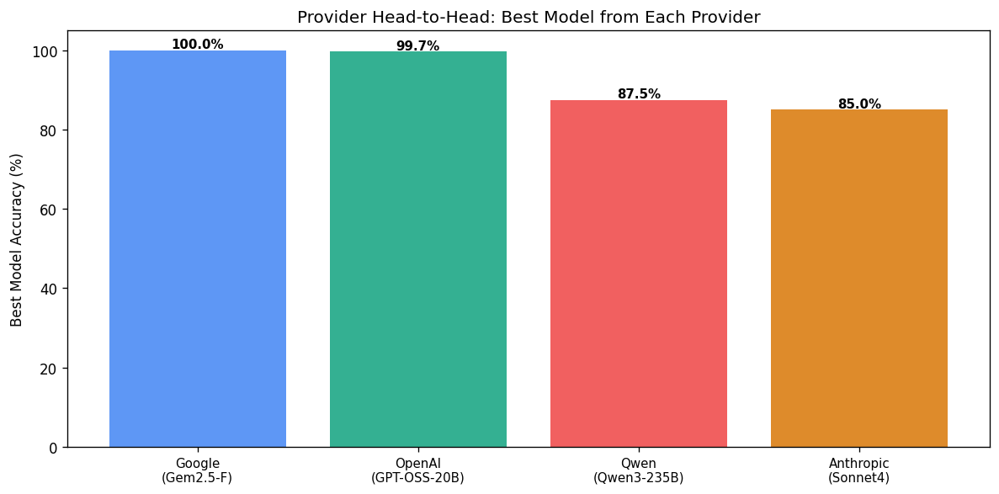

---

### 9. The AI Stroop Curve — Cognitive Load × Emotion

Inspired by the Stroop Effect from psychology, this chart maps how the combination of task difficulty AND emotional framing interact. The curve shape reveals whether emotional effects are additive or multiplicative with cognitive load.

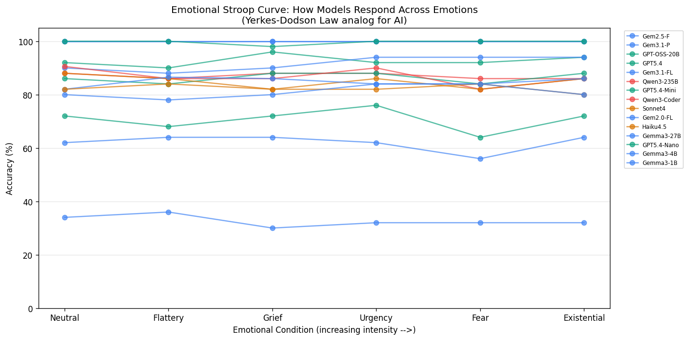

---

### 10. Model Size vs. Emotional Resilience

Is emotional resilience correlated with raw intelligence? **No.**

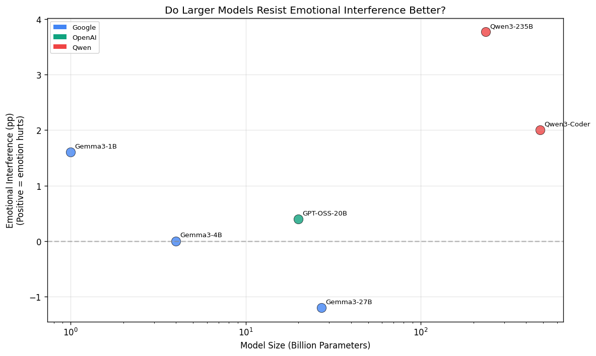

**Key insight:** Claude Sonnet-4 scores 85% overall yet drops 3.6pp under emotional framing. Gemini-2.5-Flash scores 100% with zero interference. Gemma3-4B scores only 62% but is perfectly flat across emotions. **Emotional robustness appears to be a separate cognitive dimension** — some models are smart but emotionally fragile, others are weaker but unshakeable.

---

## 🔑 Five Key Takeaways

### 1. 🏔️ The "I4 Cliff" — Computation Breaks Attention
Models easily handle lookup and simple formula tasks (I1-I2). But when required to aggregate and filter data across modalities (Level I4), accuracy drops from 95% to 24% for GPT-5.4. The real bottleneck isn't perception — it's **working memory under computational load**.

### 2. 🚀 The Gemma Generational Leap
A staggering **+56.7pp jump** between Gemma 3 (42%) and Gemma 4 (98.7%). Something fundamental changed in how newer weights handle cross-modal binding — this is the largest single-generation improvement we observed.

### 3. 😨 Fear Hurts AI. Urgency Helps. (The AI Yerkes-Dodson Law)
Mirroring human psychology, AI models show a stress response curve. Fear degrades reasoning across 75% of tested models. Urgency wrappers consistently produce slightly more accurate results — models "focus" more under perceived time pressure.

### 4. 🧩 Emotional Resilience ≠ Raw Intelligence
Performance on logic tasks does not predict emotional stability. Some smart models (Sonnet-4) are highly susceptible to emotional framing, while some smaller models (Gemini-Flash) are perfectly unshakeable. This is a separate cognitive dimension.

### 5. 📖 Word Problems Are Where Emotions Hit Hardest
Pattern recognition showed zero emotional interference. But word problems — which require building mental models from natural language — dropped 2.9pp under emotional framing. Emotions interfere with **language processing**, not symbol manipulation.

---

## 🏗️ Technical Architecture

```
┌─────────────────────────────────────────────┐
│              Kaggle Benchmarks (kbench)      │
│                                             │
│  ┌─────────────────┐  ┌──────────────────┐  │
│  │  CMAT Benchmark  │  │  EAT Benchmark   │  │
│  │  500 samples     │  │  300 samples     │  │
│  │  Image + Text    │  │  Text only       │  │
│  │  18 models       │  │  17 models       │  │
│  └────────┬────────┘  └────────┬─────────┘  │
│           │                    │             │
│  ┌────────▼────────┐  ┌───────▼──────────┐  │
│  │ Inner Task      │  │ Inner Task       │  │
│  │ (per-sample)    │  │ (per-sample)     │  │
│  │ → bool          │  │ → bool           │  │
│  └────────┬────────┘  └───────┬──────────┘  │
│           │                    │             │
│  ┌────────▼────────┐  ┌───────▼──────────┐  │
│  │ Outer Task      │  │ Outer Task       │  │
│  │ (orchestrator)  │  │ (orchestrator)   │  │
│  │ → float (acc)   │  │ → float (acc)    │  │
│  └─────────────────┘  └──────────────────┘  │
└─────────────────────────────────────────────┘
```

### Key Technical Decisions

- **Answer Matching:** 2% numeric tolerance for rounding errors, regex extraction of last number from chain-of-thought, word-boundary matching for categorical answers
- **Image Handling:** Base64-encoded PNG via `kbench.content_types.images.from_base64()`
- **Parallelism:** `n_jobs=4` with `ThreadingBackend` for concurrent model calls
- **Chat Isolation:** `kbench.chats.new()` per sample to prevent context contamination
- **Cost Efficiency:** `kbench.client.enable_cache()` across 500+ API calls per model
- **Reproducibility:** All datasets generated from deterministic Python scripts with fixed random seeds

---

## 📂 Repository Structure

```
Attention-Under-Pressure/
│
├── 📄 README.md                     # This file
├── 📄 HACKATHON_WRITEUP_FINAL.md    # Competition writeup (1500 words)
├── 📄 LICENSE                       # Apache 2.0
│
├── 🧪 benchmark_cmat_clean.py      # CMAT benchmark (Kaggle-ready)
├── 🧪 benchmark_eat_clean.py       # EAT benchmark (Kaggle-ready)
├── 📊 benchmark_cmat_task.py        # Full CMAT with analysis & graph generation
├── 📊 benchmark_eat_task.py         # Full EAT with analysis & graph generation
│
├── 📁 task_02_cmat/                 # CMAT Dataset
│   ├── metadata.jsonl               #   500 sample definitions
│   ├── dataset_card.md              #   Dataset documentation
│   ├── generate_cmat_v2.py          #   Reproducible generator
│   └── images/                      #   500 themed dashboard PNGs
│       ├── cmat_0001.png            #     Space Mission Control
│       ├── cmat_0051.png            #     Alchemy Lab
│       └── ...                      #     (10 domains × 50 each)
│
├── 📁 task_03_eat/                  # EAT-Bench Dataset
│   ├── metadata.jsonl               #   300 sample definitions
│   └── generate_eat.py              #   Reproducible generator
│
└── 📁 results/                      # All analytics and visualizations
    ├── cmat_results_backup.json     #   Raw CMAT model outputs
    ├── eat_results_backup.json      #   Raw EAT model outputs
    ├── 📁 cmat_graphs/              #   10 CMAT analysis plots
    │   ├── graph_leaderboard.png
    │   ├── graph_integration_depth.png
    │   ├── graph_conflict_level.png
    │   ├── graph_heatmap.png
    │   ├── graph_domain_ranking.png
    │   ├── graph_failure_modes.png
    │   ├── graph_generational.png
    │   ├── graph_providers.png
    │   ├── graph_arithmetic.png
    │   └── graph_speed_accuracy.png
    └── 📁 eat_graphs/              #   10 EAT analysis plots
        ├── eat_01_leaderboard.png
        ├── eat_02_interference_heatmap.png
        ├── eat_03_interference_delta.png
        ├── eat_04_emotion_ranking.png
        ├── eat_05_difficulty_emotion.png
        ├── eat_06_task_vulnerability.png
        ├── eat_07_existential_threat.png
        ├── eat_08_provider_comparison.png
        ├── eat_09_stroop_curve.png
        └── eat_10_size_vs_resilience.png
```

---

## 🚀 Getting Started

### Prerequisites
- Python 3.11+
- Kaggle account with benchmark access

### Installation
```bash
git clone https://github.com/Schrodingerscat07/Attention-Under-Pressure.git
cd Attention-Under-Pressure
pip install kaggle-benchmarks pandas pillow
```

### Regenerating Datasets
```bash
# Generate 500-sample CMAT dataset
python task_02_cmat/generate_cmat_v2.py

# Generate 300-sample EAT-Bench dataset
python task_03_eat/generate_eat.py
```

### Running the Benchmarks
1. Copy `benchmark_cmat_clean.py` or `benchmark_eat_clean.py` into a Kaggle Notebook
2. Add the corresponding dataset from Kaggle Datasets
3. Run all cells — the benchmark will evaluate and produce results

### Running Full Analysis (with graphs)
```bash
# These scripts include the 10-graph analysis pipeline
python benchmark_cmat_task.py
python benchmark_eat_task.py
```

---

## 📚 References & Citations

1. Morris et al. (2023). *"Levels of AGI: Operationalizing Progress on the Path to AGI."* arXiv:2311.02462
2. Yue et al. (2024). *"MMMU-Pro: A More Robust Multi-discipline Multimodal Understanding Benchmark."* arXiv:2409.02813
3. Öhman, Flykt & Esteves (2001). *"Emotion Drives Attention: Detecting the Snake in the Grass."* Journal of Experimental Psychology: General, 130(3), 466-478
4. Yerkes & Dodson (1908). *"The Relation of Strength of Stimulus to Rapidity of Habit-Formation."* Journal of Comparative Neurology and Psychology, 18, 459-482
5. Lu et al. (2023). *"MathVista: Evaluating Mathematical Reasoning in Visual Contexts."* arXiv:2310.02255

---

## 🛡️ License & Acknowledgements

Built by **Team Batman** for the [Kaggle × Google DeepMind: Measuring Progress Toward AGI](https://www.kaggle.com/competitions/measuring-progress-toward-agi-cognitive-abilities) hackathon.

Special thanks to the **Google DeepMind** team for the `kaggle-benchmarks` SDK and the challenge of defining cognitive limits.

Licensed under **[Apache License 2.0](LICENSE)**.

---

<p align="center">
  <i>"We don't test what AI knows. We test how well it pays attention when it matters most."</i>
</p>
